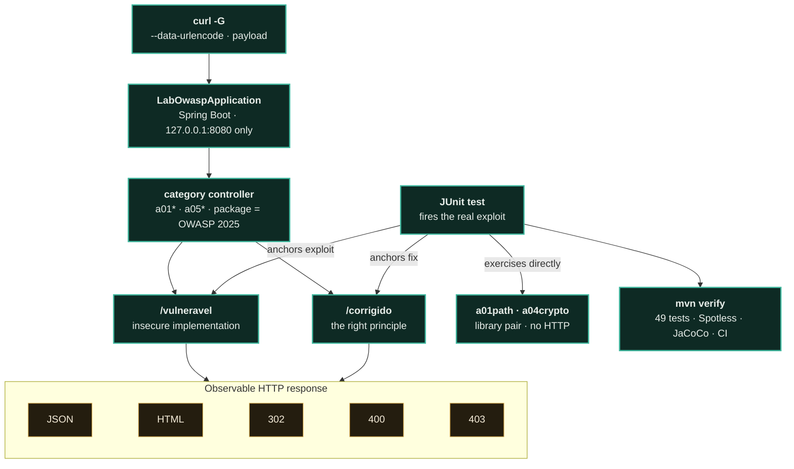

<p align="center"><a href="README.md"></a></p>

<a href="https://paulo-marcos-lucio.github.io"></a>

<div align="center">

# 🧪 OWASP Lab

### Categories **A01, A04, and A05** of the OWASP Top 10:2025, each lesson in **three acts**: vulnerable → exploit → fixed.

*A **Spring Boot** application for **learning AppSec with code that runs**, not slides. Each category of the OWASP Top 10:2025 is a pair of endpoints on the same controller — `/vulneravel` and `/corrigido`: the request comes in, lands on one of the two sides, and comes back as JSON, HTML, or an HTTP status. An **automated test anchors each side** — it fires the real exploit, confirms it succeeds against the vulnerable side, and gets blocked on the fixed side. There are **49 green tests** in total: "diagnosis and fix" as executable code, on the Java stack.*

[](https://github.com/Paulo-Marcos-Lucio/laboratorio-owasp/actions/workflows/ci.yml)
[](https://github.com/Paulo-Marcos-Lucio/laboratorio-owasp/actions/workflows/codeql.yml)
[](https://openjdk.org/)
[](https://spring.io/projects/spring-boot)
[](LICENSE)
[](https://owasp.org/Top10/)
[](#running-the-tests-the-proof)
[](#running-the-tests-the-proof)
[](#-engineering-quality--method)

</div>

---

## ⚠️ Warning

This application contains vulnerabilities **on purpose**, for educational purposes.

The application **only listens on `127.0.0.1`** (`server.address` in `application.properties`, with a regression test in [`ConfiguracaoDeRedeTest`](src/test/java/br/com/paulomarcos/labowasp/ConfiguracaoDeRedeTest.java)). **Do not change this, and do not publish port 8080 in a container** — use `-p 127.0.0.1:8080:8080`, never `-p 8080:8080`. The reason is concrete: `/a05/cmd/vulneravel` executes arbitrary operating-system commands, without authentication. With Spring Boot's default (`0.0.0.0`), any machine on the same Wi-Fi — coworking space, university, coffee shop — or on your mesh VPN would be able to execute commands on your computer.

Using these exploitation techniques outside this lab, against a third party's system without written authorization, is a crime in Brazil (Law 12.737/2012, with penalties expanded by Law 14.155/2021).

---

## 🎯 The Idea

Reading about a vulnerability is one thing; **watching the exploit succeed** and then **watching the fix block it** is another. Each module here is a pair:

- `…/vulneravel` — the insecure implementation, with a comment explaining the mistake.
- `…/corrigido` — the same functionality, done securely.
- a **test** that fires the real exploit and asserts the behavior of both sides.

Most pairs are exposed through an **HTTP endpoint**. Two — Path Traversal (`a01path`) and password hashing (`a04crypto`) — are **library** pairs: a class with both methods, exercised directly by the test, with no HTTP route. They're marked as *(no endpoint)* in the table.

If the tests pass, the demonstration is honest: the flaw is real and **the fix actually works** — the app **only listens on `127.0.0.1`** (with a test that fails the build if the line disappears), the BCrypt on the fixed side **rejects the wrong password** that the vulnerable encoder (CVE-2025-22228) used to authenticate, and the fixed SSRF **blocks the internal address** even for a host that's on the allowlist. And two tests do the opposite: they **document the limits** of what's implemented — `SsrfLimiteRebindingTest` (the IP layer does **not** prevent DNS rebinding — it's TOCTOU) and `HashSenhaTest#bcryptSoConsideraOs72PrimeirosBytes`. A lab that hides the limits of its own control teaches the wrong lesson.

---

## 🗂️ The Vulnerabilities

| OWASP 2025 | Vulnerability | Where | Test That Proves It |
| --- | --- | --- | --- |
| **A05** | SQL Injection (CWE-89) | [`a05sqli`](src/main/java/br/com/paulomarcos/labowasp/a05sqli) | [`SqlInjectionTest`](src/test/java/br/com/paulomarcos/labowasp/a05sqli/SqlInjectionTest.java) |
| **A05** | Reflected XSS (CWE-79) | [`a05xss`](src/main/java/br/com/paulomarcos/labowasp/a05xss) | [`XssTest`](src/test/java/br/com/paulomarcos/labowasp/a05xss/XssTest.java) |
| **A05** | Command Injection (CWE-78) | [`a05cmd`](src/main/java/br/com/paulomarcos/labowasp/a05cmd) | [`CommandInjectionTest`](src/test/java/br/com/paulomarcos/labowasp/a05cmd/CommandInjectionTest.java) |
| **A01** | IDOR — Broken Access Control (CWE-639) | [`a01idor`](src/main/java/br/com/paulomarcos/labowasp/a01idor) | [`IdorTest`](src/test/java/br/com/paulomarcos/labowasp/a01idor/IdorTest.java) |
| **A01** | Path Traversal (CWE-22) *(no endpoint)* | [`a01path`](src/main/java/br/com/paulomarcos/labowasp/a01path) | [`ArquivoServiceTest`](src/test/java/br/com/paulomarcos/labowasp/a01path/ArquivoServiceTest.java) |
| **A01** | Open Redirect (CWE-601) | [`a01redirect`](src/main/java/br/com/paulomarcos/labowasp/a01redirect) | [`OpenRedirectTest`](src/test/java/br/com/paulomarcos/labowasp/a01redirect/OpenRedirectTest.java) |
| **A01** | SSRF (CWE-918) | [`a01ssrf`](src/main/java/br/com/paulomarcos/labowasp/a01ssrf) | [`SsrfTest`](src/test/java/br/com/paulomarcos/labowasp/a01ssrf/SsrfTest.java) |
| **A04** | Weak password hashing: MD5 → BCrypt (CWE-916) *(no endpoint)* | [`a04crypto`](src/main/java/br/com/paulomarcos/labowasp/a04crypto) | [`HashSenhaTest`](src/test/java/br/com/paulomarcos/labowasp/a04crypto/HashSenhaTest.java) |

**Coverage: 3 of the 10 categories in the OWASP Top 10:2025** (A01, A04, A05), with **49 green tests** proving exploit and fix. A02, A03, A06, A07, A08, A09, and A10 don't have a pair yet — contributions are welcome (see [CONTRIBUTING](CONTRIBUTING.md)).

> The codes are from the **2025** edition. If you know the 2021 list, here's the translation: SQLi/XSS/Command Injection moved from A03 to **A05**, password hashing moved from A02 to **A04**, and SSRF (A10:2021) was absorbed into **A01**. Package names follow the current code.

---

## 🚀 Running

**Prerequisites:** just **JDK 21+** and **git**. Maven ships embedded in the wrapper (`./mvnw`) — don't install anything beyond that. Check with `java -version` (the first line needs to show `21` or higher).

### Quickstart — From Zero to the First Exploit

```bash
git clone https://github.com/Paulo-Marcos-Lucio/laboratorio-owasp.git
cd laboratorio-owasp
./mvnw spring-boot:run      # starts at http://127.0.0.1:8080 (loopback only). On Windows: .\mvnw.cmd spring-boot:run
```

The first time, Maven downloads the dependencies; wait for the `Started LabOwaspApplication` line. In **another terminal**, fire the first exploit — a SQL Injection that returns the entire table from a search for "Notebook":

```bash
curl -sG --data-urlencode "nome=Notebook' OR '1'='1" http://localhost:8080/a05/sqli/vulneravel
# → [{"ID":1,"NOME":"Notebook","PRECO":4500.00},{"ID":2,"NOME":"Mouse","PRECO":120.00},{"ID":3,"NOME":"Teclado","PRECO":250.00}]
```

Did the entire table come back? The lab is up and running. The **[See the Exploit and the Fix Side by Side](#see-the-exploit-and-the-fix-side-by-side)** section below has the `vulneravel`/`corrigido` pair for each lesson.

Just the tests, without starting anything — including in Docker:

```bash
./mvnw test        # 49 tests; ./mvnw verify includes the formatting check (Spotless)
docker run --rm -v "$PWD":/app -w /app maven:3.9-eclipse-temurin-21 mvn verify
```

### Configuration

Almost everything is fixed on purpose — this is a lab, not a configurable app. Two properties matter:

| Property | Default | What It's For |
| --- | --- | --- |
| `ssrf.allowlist` | `api.example.com,cdn.example.com` | The hosts that `/a01/ssrf/corrigido` accepts at **layer 1**. Override it to feel the defense change: `./mvnw spring-boot:run -Dspring-boot.run.arguments=--ssrf.allowlist=api.example.com` — then `cdn.example.com` starts responding with `host fora da allowlist`. |
| `server.address` | `127.0.0.1` | **Do not change this.** The loopback bind is the only thing that keeps `/a05/cmd/vulneravel` (arbitrary command execution) from being exposed to the network. The `ConfiguracaoDeRedeTest` test fails the build if the line disappears. |

### See the Exploit and the Fix Side by Side

The payloads contain spaces, quotes, and `<`. Pasting them directly into the URL makes curl refuse (`curl: (3) URL rejected`) and Tomcat return 400 before the controller ever sees the request. That's why every example uses `curl -G --data-urlencode`, which encodes the parameter for you.

```bash
# A05 — SQL Injection: the payload returns the entire table...
curl -sG --data-urlencode "nome=Notebook' OR '1'='1" http://localhost:8080/a05/sqli/vulneravel
# → [{"ID":1,"NOME":"Notebook",...},{"ID":2,"NOME":"Mouse",...},{"ID":3,...}]
# ...and the parameterized version returns empty:
curl -sG --data-urlencode "nome=Notebook' OR '1'='1" http://localhost:8080/a05/sqli/corrigido
# → []

# A05 — XSS: the <script> comes back raw (vulnerable) vs. escaped (fixed)
curl -sG --data-urlencode "q=<script>alert(1)</script>" http://localhost:8080/a05/xss/vulneravel
# → <p>Voce buscou: <script>alert(1)</script></p>
curl -sG --data-urlencode "q=<script>alert(1)</script>" http://localhost:8080/a05/xss/corrigido
# → <p>Voce buscou: &lt;script&gt;alert(1)&lt;/script&gt;</p>

# A05 — Command Injection: the "&& echo" runs a 2nd command (vulnerable) vs. 400 (fixed)
curl -sG --data-urlencode "host=127.0.0.1 && echo INJETADO" http://localhost:8080/a05/cmd/vulneravel
# → pong de 127.0.0.1
#   INJETADO          <- on its own line: the command actually ran
curl -isG --data-urlencode "host=127.0.0.1 && echo INJETADO" http://localhost:8080/a05/cmd/corrigido
# → HTTP/1.1 400 ... host invalido

# A01 — IDOR: bob reads alice's note (vulnerable) vs. 403 (fixed)
curl -s -H "X-Usuario: bob" http://localhost:8080/a01/idor/vulneravel/1
# → {"id":1,"dono":"alice","texto":"Dados bancarios da Alice"}
curl -is -H "X-Usuario: bob" http://localhost:8080/a01/idor/corrigido/1
# → HTTP/1.1 403

# A01 — Open Redirect: external destination redirects (vulnerable) vs. 400 (fixed)
curl -is "http://localhost:8080/a01/redirect/vulneravel?destino=https://site-falso.example"
# → HTTP/1.1 302 / Location: https://site-falso.example
curl -is "http://localhost:8080/a01/redirect/corrigido?destino=https://site-falso.example"
# → HTTP/1.1 400
curl -is "http://localhost:8080/a01/redirect/corrigido?destino=%2Fpainel"
# → HTTP/1.1 302 / Location: /painel      <- the legitimate use case still works

# A01 — SSRF: the server fetches a URL of your choosing.
# Reproducible target: another endpoint of this same lab, on loopback.
curl -sG --data-urlencode "url=http://127.0.0.1:8080/a05/xss/corrigido?q=oi" \
  http://localhost:8080/a01/ssrf/vulneravel
# → <p>Voce buscou: oi</p>    <- the SERVER made the request for you
curl -isG --data-urlencode "url=http://127.0.0.1:8080/a05/xss/corrigido?q=oi" \
  http://localhost:8080/a01/ssrf/corrigido
# → HTTP/1.1 400 ... host fora da allowlist
```

The classic SSRF target is the cloud metadata endpoint (`http://169.254.169.254/latest/meta-data/`), which hands over the instance's temporary credentials. It **doesn't work as a runnable example outside a cloud environment**: the IP doesn't respond, and `/vulneravel` returns `502 nao foi possivel buscar a URL: Network is unreachable`. That's why the example above uses a loopback target instead.

On `/corrigido`, with the default allowlist, that IP gets stopped at **layer 1** (`host fora da allowlist`). The one that blocks via **layer 2** — the internal-address check, which is the real defense against an authorized host that points inward — is [`SsrfDefesaIpTest`](src/test/java/br/com/paulomarcos/labowasp/a01ssrf/SsrfDefesaIpTest.java), which puts `169.254.169.254`, `127.0.0.1`, and `10.0.0.5` **inside** the allowlist on purpose and asserts the refusal with the reason `destino interno bloqueado`.


### Running the Tests (the Proof)

```bash
./mvnw verify     # tests + formatting check (spotless)
./mvnw test       # just the tests
./mvnw spotless:apply   # fixes the formatting
```

---

## 🔓 Pro Version (Private)

This lab is open — it's the **showcase** for the "vulnerable → exploit → fixed" method. Here, Pro **isn't a different engine**, nor is it a "stronger" engine: the code is this very code. Pro is a **service** — human work that brings this method to your team's real codebase.

| | Public Tool (You Run It) | Pro / Service (I Run It with You) |
| --- | --- | --- |
| **What It Is** | This lab, open and complete | Live, hands-on mentoring and training |
| **Engine** | 8 `vulneravel`/`corrigido` pairs, 49 green tests | **The same one** — the code is this; Pro is human work |
| **Where It Runs** | In the lab, on loopback and synthetic targets | On **your** real codebase |
| **Method** | You read the pair and the test at your own pace | Guided path from exploit to fix, alongside your team |
| **Coverage** | 3 of the 10 categories (A01, A04, A05) | Advanced scenarios tailored to your stack |
| **Delivery** | Self-study via the README and the tests | Dev-team training with executable code, not slides |

<div align="center">

[](https://paulo-marcos-lucio.github.io)
[](https://www.linkedin.com/in/paulo-marcos-a07379174/)

</div>

---

## 🏗️ Architecture

The flow is the same across every category: the request comes in through **Spring Boot** (which only listens on `127.0.0.1`), lands in the **category's controller** — the `/vulneravel` side or the `/corrigido` side — and comes back as **JSON, HTML, or an HTTP status**. A **JUnit test** anchors both sides: it fires the real exploit and requires that it succeed on the vulnerable side and get blocked on the fixed side, with `mvn verify` failing the build if either side strays from the script. Two pairs — `a01path` and `a04crypto` — skip HTTP entirely and are exercised directly by the test (*no endpoint*).



The package name is the OWASP Top 10:2025 code. Each test package mirrors the production one, so the entire lesson — vulnerable, fixed, and proof — lives in the same folder.

```
src/main/java/.../labowasp/
├── a01idor/     IDOR — resource-ownership verification
├── a01path/     Path Traversal — normalization + confinement to the base directory
├── a01redirect/ Open Redirect — only accepts a path relative to the app itself
├── a01ssrf/     SSRF — arbitrary URL fetch vs. host allowlist + internal-IP blocking
├── a04crypto/   Password hashing — MD5 (wrong) vs. BCrypt (right)
├── a05cmd/      Command Injection — shell with concatenated input vs. allowlist without a shell
├── a05sqli/     SQL Injection — concatenation vs. parameterized query
└── a05xss/      XSS — raw reflection vs. output encoding
```

Each fix applies **the right principle**, not a patch: query parameterization, output encoding, ownership-based authorization, path confinement, redirects restricted to internal destinations, allowlist validation without passing input to a shell, host allowlisting with internal-address blocking (loopback/private/metadata), and slow salted hashing.

### What This Lab Does NOT Do

Written here so no one finds out the hard way later:

- **The SSRF allowlist does not prevent DNS rebinding.** Validation and the fetch resolve the hostname independently (TOCTOU), and the already-validated address gets discarded. This is reproduced in [`SsrfLimiteRebindingTest`](src/test/java/br/com/paulomarcos/labowasp/a01ssrf/SsrfLimiteRebindingTest.java), which leaks the secret with an HTTP 200. Against static configuration (split-horizon, a misconfigured allowlist) the layer works — that's its actual scope.
- **BCrypt only considers the first 72 bytes of the password.** The encoder rejects longer passwords (that's the fix for CVE-2025-22228), but verifying an old 72-byte hash still ignores the suffix. A long passphrase in production requires pre-hashing or Argon2id/scrypt.
- **There's no authentication, session, or CSRF.** This isn't a reference app: it's a set of isolated lessons.

---

## 🔬 Engineering Quality & Method

**Gates (measured now with `./mvnw -B verify`):** **49 green tests** · **google-java-format AOSP-style** formatting + unused-import removal via **Spotless** — `spotless:check` fails the build, 28 clean files · CI in a **single job, Java 21 (temurin)** on `ubuntu-latest`. **JaCoCo measures** coverage and emits the report (measured now: **91% line, 85% branch**), but **doesn't gate on %**, by design: the gate that matters here isn't the %, it's the **exploit × fix proof** — the exploit succeeds against `/vulneravel` and is blocked on `/corrigido`, asserted in an automated test. Measuring without gating keeps the % honest and visible without turning the metric into a numbers theater.

**Anti-façade discipline.** A test that passes by accident teaches the wrong lesson. [`SsrfDefesaIpTest`](src/test/java/br/com/paulomarcos/labowasp/a01ssrf/SsrfDefesaIpTest.java) puts `127.0.0.1`, `169.254.169.254`, and `10.0.0.5` **inside** the allowlist on purpose and asserts the **reason** for the refusal (`destino interno bloqueado`), not just the 400 status — that way, if layer 2 (internal-IP blocking) gets deleted, the test goes red instead of passing on an NXDOMAIN from the runner. Two tests go the opposite direction and **document the limit** of the control: `SsrfLimiteRebindingTest` (the allowlist doesn't prevent DNS rebinding — it's TOCTOU) and `HashSenhaTest#bcryptSoConsideraOs72PrimeirosBytes`.

**Architecture confirmed by reading the code** (11 source files, 16 test classes):

- **Package name = OWASP 2025 code** (`a01ssrf`, `a04crypto`, `a05sqli`…): the taxonomy is the single source of truth, not a loose comment.
- **Test package mirrors the production one** — vulnerable, fixed, and proof live in the same folder.
- **Two-layer defense in depth** in SSRF (host allowlist → internal-address blocking); each fix applies **the principle** (parameterization, output encoding, path confinement, salted BCrypt), not a one-off patch.

**Supply chain and self-audit of the repo itself.** All actions are **pinned by 40-hex SHA** (never a moving tag), with minimal `permissions:` per job, `timeout-minutes`, `concurrency` with cancellation, and `persist-credentials: false` on checkout. Beyond the `verify` gate, two security fronts audit the lab itself: **CodeQL** (SAST on `java-kotlin`, `security-extended`, with a manual build via `mvnw`, weekly + push/PR) and **Dependency Review** (blocks the PR on a new dependency with a high CVE or an incompatible license). Continuous SCA (CVEs in already-existing dependencies) is handled by grouped **Dependabot** (github-actions and maven, weekly), which is native and doesn't depend on an external credential. Surefire sets `-Dsun.net.inetaddr.ttl=0` so the rebinding test can actually demonstrate the TOCTOU within a single request.

**Portuguese in code, tests, and docs** is a deliberate decision for consistency: method names (`corrigidoBloqueiaIpDeMetadadosDeNuvemAindaQueNaAllowlist`), error messages, and comments all speak the same language — the repo is teaching material, and reading it is part of the product.

---

## ⚖️ Ethical Use

**Educational and defensive** material. The exploitation techniques exist to help you understand and fix the flaw — use them only in this lab or on a system for which you have **written authorization**, with a defined scope and time window.

In Brazil, unauthorized access to someone else's computing device is a crime (Law 12.737/2012, with penalties expanded by Law 14.155/2021); the Marco Civil da Internet (Law 12.965/2014) and the LGPD (Law 13.709/2018) also apply to whatever you do with the data obtained. See [SECURITY.md](SECURITY.md).

---

## 📄 License

[MIT](LICENSE) © 2026 Paulo Marcos Lucio.

---

<div align="center">
<sub>Part of the AppSec suite — alongside <a href="https://github.com/Paulo-Marcos-Lucio/sentinela">Sentinela</a>, <a href="https://github.com/Paulo-Marcos-Lucio/guardiao">Guardião</a>, <a href="https://github.com/Paulo-Marcos-Lucio/chaveiro">Chaveiro</a>, and <a href="https://github.com/Paulo-Marcos-Lucio/esteira">Esteira</a>.</sub>
</div>
