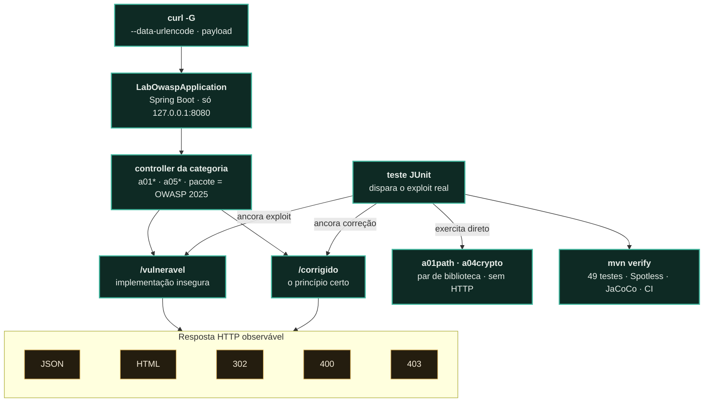

<p align="center"><a href="README.en.md"></a></p>

<a href="https://paulo-marcos-lucio.github.io"></a>

<div align="center">

# 🧪 Laboratório OWASP

### As categorias **A01, A04 e A05** do OWASP Top 10:2025, cada lição em **três atos**: vulnerável → exploit → corrigido.

*Uma aplicação **Spring Boot** para **aprender AppSec com código que roda**, não com slide. Cada categoria do OWASP Top 10:2025 é um par de endpoints no mesmo controller — `/vulneravel` e `/corrigido`: a requisição entra, cai num dos dois lados e volta como JSON, HTML ou status HTTP. Um **teste automatizado ancora cada lado** — dispara o exploit real, confirma que ele passa no vulnerável e é barrado no corrigido. São **49 testes verdes** ao todo: o "diagnóstico e correção" em código executável, no stack Java.*

[](https://github.com/Paulo-Marcos-Lucio/laboratorio-owasp/actions/workflows/ci.yml)
[](https://github.com/Paulo-Marcos-Lucio/laboratorio-owasp/actions/workflows/codeql.yml)
[](https://openjdk.org/)
[](https://spring.io/projects/spring-boot)
[](LICENSE)
[](https://owasp.org/Top10/)
[](#rodando-os-testes-a-prova)
[](#rodando-os-testes-a-prova)
[](#-qualidade-de-engenharia--método)

</div>

---

## ⚠️ Aviso

Esta aplicação contém vulnerabilidades **de propósito**, para fins educativos.

A aplicação **só escuta em `127.0.0.1`** (`server.address` em `application.properties`, com teste de regressão em [`ConfiguracaoDeRedeTest`](src/test/java/br/com/paulomarcos/labowasp/ConfiguracaoDeRedeTest.java)). **Não altere isso e não publique a porta 8080 em contêiner** — use `-p 127.0.0.1:8080:8080`, nunca `-p 8080:8080`. O motivo é concreto: `/a05/cmd/vulneravel` executa comandos arbitrários do sistema operacional, sem autenticação. Com o padrão do Spring Boot (`0.0.0.0`), qualquer máquina do mesmo Wi‑Fi — coworking, faculdade, café — ou da sua VPN de malha executaria comandos no seu computador.

O uso das técnicas de exploração fora deste laboratório, em sistema de terceiro sem autorização por escrito, é crime no Brasil (Lei 12.737/2012, com as penas ampliadas pela Lei 14.155/2021).

---

## 🎯 A ideia

Ler sobre uma vulnerabilidade é uma coisa; **ver o exploit passar** e depois **ver a correção barrá-lo** é outra. Cada módulo aqui é um par:

- `…/vulneravel` — a implementação insegura, com o comentário explicando o erro.
- `…/corrigido` — a mesma funcionalidade, feita com segurança.
- um **teste** que dispara o exploit real e afirma o comportamento dos dois lados.

A maioria dos pares é exposta por **endpoint HTTP**. Dois — Path Traversal (`a01path`) e hash de senha (`a04crypto`) — são pares de **biblioteca**: uma classe com os dois métodos, exercitada direto pelo teste, sem rota HTTP. Estão marcados como *(sem endpoint)* na tabela.

Se os testes passam, a demonstração é honesta: a falha é real e **a correção funciona de verdade** — a app **só escuta em `127.0.0.1`** (com teste que reprova o build se a linha sumir), o BCrypt do lado corrigido **recusa a senha errada** que o encoder vulnerável (CVE-2025-22228) autenticava, e o SSRF corrigido **barra o endereço interno** mesmo para um host que está na allowlist. E dois testes fazem o contrário: **documentam limites** do que está implementado — `SsrfLimiteRebindingTest` (a camada de IP **não** impede DNS rebinding — é TOCTOU) e `HashSenhaTest#bcryptSoConsideraOs72PrimeirosBytes`. Um laboratório que esconde o limite do próprio controle ensina errado.

---

## 🗂️ As vulnerabilidades

| OWASP 2025 | Vulnerabilidade | Onde | Teste que prova |
| --- | --- | --- | --- |
| **A05** | SQL Injection (CWE-89) | [`a05sqli`](src/main/java/br/com/paulomarcos/labowasp/a05sqli) | [`SqlInjectionTest`](src/test/java/br/com/paulomarcos/labowasp/a05sqli/SqlInjectionTest.java) |
| **A05** | XSS refletido (CWE-79) | [`a05xss`](src/main/java/br/com/paulomarcos/labowasp/a05xss) | [`XssTest`](src/test/java/br/com/paulomarcos/labowasp/a05xss/XssTest.java) |
| **A05** | Command Injection (CWE-78) | [`a05cmd`](src/main/java/br/com/paulomarcos/labowasp/a05cmd) | [`CommandInjectionTest`](src/test/java/br/com/paulomarcos/labowasp/a05cmd/CommandInjectionTest.java) |
| **A01** | IDOR — Broken Access Control (CWE-639) | [`a01idor`](src/main/java/br/com/paulomarcos/labowasp/a01idor) | [`IdorTest`](src/test/java/br/com/paulomarcos/labowasp/a01idor/IdorTest.java) |
| **A01** | Path Traversal (CWE-22) *(sem endpoint)* | [`a01path`](src/main/java/br/com/paulomarcos/labowasp/a01path) | [`ArquivoServiceTest`](src/test/java/br/com/paulomarcos/labowasp/a01path/ArquivoServiceTest.java) |
| **A01** | Open Redirect (CWE-601) | [`a01redirect`](src/main/java/br/com/paulomarcos/labowasp/a01redirect) | [`OpenRedirectTest`](src/test/java/br/com/paulomarcos/labowasp/a01redirect/OpenRedirectTest.java) |
| **A01** | SSRF (CWE-918) | [`a01ssrf`](src/main/java/br/com/paulomarcos/labowasp/a01ssrf) | [`SsrfTest`](src/test/java/br/com/paulomarcos/labowasp/a01ssrf/SsrfTest.java) |
| **A04** | Hash de senha fraco: MD5 → BCrypt (CWE-916) *(sem endpoint)* | [`a04crypto`](src/main/java/br/com/paulomarcos/labowasp/a04crypto) | [`HashSenhaTest`](src/test/java/br/com/paulomarcos/labowasp/a04crypto/HashSenhaTest.java) |

**Cobertura: 3 das 10 categorias do OWASP Top 10:2025** (A01, A04, A05), com **49 testes verdes** provando exploit e correção. A02, A03, A06, A07, A08, A09 e A10 ainda não têm par — contribuições são bem-vindas (ver [CONTRIBUTING](CONTRIBUTING.md)).

> Os códigos são da edição **2025**. Se você conhece a lista de 2021, a tradução é: SQLi/XSS/Command Injection saíram de A03 para **A05**, hash de senha saiu de A02 para **A04** e o SSRF (A10:2021) foi absorvido por **A01**. Os nomes de pacote seguem o código atual.

---

## 🚀 Rodando

**Pré-requisitos:** só o **JDK 21+** e o **git**. O Maven vem embutido no wrapper (`./mvnw`) — não instale nada além disso. Confira com `java -version` (a primeira linha precisa mostrar `21` ou maior).

### Quickstart — do zero ao primeiro exploit

```bash
git clone https://github.com/Paulo-Marcos-Lucio/laboratorio-owasp.git
cd laboratorio-owasp
./mvnw spring-boot:run      # sobe em http://127.0.0.1:8080 (só loopback). No Windows: .\mvnw.cmd spring-boot:run
```

Na primeira vez o Maven baixa as dependências; espere a linha `Started LabOwaspApplication`. Em **outro terminal**, dispare o primeiro exploit — um SQL Injection que devolve a tabela inteira a partir de uma busca por "Notebook":

```bash
curl -sG --data-urlencode "nome=Notebook' OR '1'='1" http://localhost:8080/a05/sqli/vulneravel
# → [{"ID":1,"NOME":"Notebook","PRECO":4500.00},{"ID":2,"NOME":"Mouse","PRECO":120.00},{"ID":3,"NOME":"Teclado","PRECO":250.00}]
```

Saiu a tabela inteira? O laboratório está no ar. A seção **[Veja o exploit e a correção lado a lado](#veja-o-exploit-e-a-correção-lado-a-lado)** abaixo tem o par `vulneravel`/`corrigido` de cada lição.

Só os testes, sem subir nada — inclusive em Docker:

```bash
./mvnw test        # 49 testes; ./mvnw verify inclui a checagem de formatação (Spotless)
docker run --rm -v "$PWD":/app -w /app maven:3.9-eclipse-temurin-21 mvn verify
```

### Configuração

Quase tudo é fixo de propósito — é um laboratório, não um app configurável. Duas propriedades importam:

| Propriedade | Padrão | Para que serve |
| --- | --- | --- |
| `ssrf.allowlist` | `api.example.com,cdn.example.com` | Os hosts que o `/a01/ssrf/corrigido` aceita na **camada 1**. Sobrescreva para sentir a defesa mudar: `./mvnw spring-boot:run -Dspring-boot.run.arguments=--ssrf.allowlist=api.example.com` — aí `cdn.example.com` passa a responder `host fora da allowlist`. |
| `server.address` | `127.0.0.1` | **Não altere.** O bind em loopback é a única coisa que impede `/a05/cmd/vulneravel` (execução de comando arbitrária) de ficar exposto à rede. O teste `ConfiguracaoDeRedeTest` reprova o build se a linha sumir. |

### Veja o exploit e a correção lado a lado

Os payloads têm espaço, aspas e `<`. Copiá-los direto na URL faz o curl recusar (`curl: (3) URL rejected`) e o Tomcat devolver 400 antes de o controlador ver a requisição. Por isso todo exemplo usa `curl -G --data-urlencode`, que codifica o parâmetro para você.

```bash
# A05 — SQL Injection: o payload retorna a tabela inteira...
curl -sG --data-urlencode "nome=Notebook' OR '1'='1" http://localhost:8080/a05/sqli/vulneravel
# → [{"ID":1,"NOME":"Notebook",...},{"ID":2,"NOME":"Mouse",...},{"ID":3,...}]
# ...e a versão parametrizada retorna vazio:
curl -sG --data-urlencode "nome=Notebook' OR '1'='1" http://localhost:8080/a05/sqli/corrigido
# → []

# A05 — XSS: o <script> volta cru (vulnerável) vs. escapado (corrigido)
curl -sG --data-urlencode "q=<script>alert(1)</script>" http://localhost:8080/a05/xss/vulneravel
# → <p>Voce buscou: <script>alert(1)</script></p>
curl -sG --data-urlencode "q=<script>alert(1)</script>" http://localhost:8080/a05/xss/corrigido
# → <p>Voce buscou: &lt;script&gt;alert(1)&lt;/script&gt;</p>

# A05 — Command Injection: o "&& echo" roda um 2º comando (vulnerável) vs. 400 (corrigido)
curl -sG --data-urlencode "host=127.0.0.1 && echo INJETADO" http://localhost:8080/a05/cmd/vulneravel
# → pong de 127.0.0.1
#   INJETADO          <- numa linha própria: o comando rodou de verdade
curl -isG --data-urlencode "host=127.0.0.1 && echo INJETADO" http://localhost:8080/a05/cmd/corrigido
# → HTTP/1.1 400 ... host invalido

# A01 — IDOR: bob lê a nota da alice (vulnerável) vs. 403 (corrigido)
curl -s -H "X-Usuario: bob" http://localhost:8080/a01/idor/vulneravel/1
# → {"id":1,"dono":"alice","texto":"Dados bancarios da Alice"}
curl -is -H "X-Usuario: bob" http://localhost:8080/a01/idor/corrigido/1
# → HTTP/1.1 403

# A01 — Open Redirect: destino externo redireciona (vulnerável) vs. 400 (corrigido)
curl -is "http://localhost:8080/a01/redirect/vulneravel?destino=https://site-falso.example"
# → HTTP/1.1 302 / Location: https://site-falso.example
curl -is "http://localhost:8080/a01/redirect/corrigido?destino=https://site-falso.example"
# → HTTP/1.1 400
curl -is "http://localhost:8080/a01/redirect/corrigido?destino=%2Fpainel"
# → HTTP/1.1 302 / Location: /painel      <- o caso de uso legítimo continua funcionando

# A01 — SSRF: o servidor busca uma URL escolhida por você.
# Alvo reproduzível: outro endpoint deste mesmo laboratório, no loopback.
curl -sG --data-urlencode "url=http://127.0.0.1:8080/a05/xss/corrigido?q=oi" \
  http://localhost:8080/a01/ssrf/vulneravel
# → <p>Voce buscou: oi</p>    <- o SERVIDOR fez a requisição por você
curl -isG --data-urlencode "url=http://127.0.0.1:8080/a05/xss/corrigido?q=oi" \
  http://localhost:8080/a01/ssrf/corrigido
# → HTTP/1.1 400 ... host fora da allowlist
```

O alvo clássico do SSRF é o endpoint de metadados de nuvem (`http://169.254.169.254/latest/meta-data/`), que entrega credenciais temporárias da instância. Ele **não serve de exemplo executável fora de uma nuvem**: o IP não responde, e o `/vulneravel` devolve `502 nao foi possivel buscar a URL: Network is unreachable`. Por isso o exemplo acima usa um alvo de loopback.

No `/corrigido`, com a allowlist padrão, esse IP para na **camada 1** (`host fora da allowlist`). Quem barra pela **camada 2** — a checagem de endereço interno, que é a defesa de verdade contra um host autorizado que aponta para dentro — é o [`SsrfDefesaIpTest`](src/test/java/br/com/paulomarcos/labowasp/a01ssrf/SsrfDefesaIpTest.java), que coloca `169.254.169.254`, `127.0.0.1` e `10.0.0.5` **dentro** da allowlist de propósito e afirma a recusa com o motivo `destino interno bloqueado`.


### Rodando os testes (a prova)

```bash
./mvnw verify     # testes + verificação de formatação (spotless)
./mvnw test       # só os testes
./mvnw spotless:apply   # conserta a formatação
```

---

## 🔓 Versão Pro (privada)

Este laboratório é aberto — é a **vitrine** do método "vulnerável → exploit → corrigido". Aqui o Pro **não é um motor diferente** nem uma engine "mais forte": o código é este mesmo. O Pro é **serviço** — trabalho humano que leva este método à base de código real do seu time.

| | Ferramenta pública (você roda) | Pro / serviço (eu conduzo com você) |
| --- | --- | --- |
| **O que é** | Este laboratório, aberto e completo | Mentoria e treinamento hands-on, ao vivo |
| **Engine** | 8 pares `vulneravel`/`corrigido`, 49 testes verdes | **A mesma** — o código é este; o Pro é trabalho humano |
| **Onde roda** | No lab, em loopback e alvos sintéticos | Na **sua** base de código real |
| **Método** | Você lê o par e o teste no seu ritmo | Trilha guiada do exploit à correção, junto do time |
| **Cobertura** | 3 das 10 categorias (A01, A04, A05) | Cenários avançados sob medida para o seu stack |
| **Entrega** | Autoestudo pelo README e pelos testes | Treinamento do time de dev com código executável, não slide |

<div align="center">

[](https://paulo-marcos-lucio.github.io)
[](https://www.linkedin.com/in/paulo-marcos-a07379174/)

</div>

---

## 🏗️ Arquitetura

O fluxo é o mesmo em toda categoria: a requisição entra pelo **Spring Boot** (que só escuta em `127.0.0.1`), cai no **controller da categoria** — lado `/vulneravel` ou `/corrigido` — e volta como **JSON, HTML ou status HTTP**. Um **teste JUnit** ancora os dois lados: dispara o exploit real e exige que ele passe no vulnerável e seja barrado no corrigido, com `mvn verify` reprovando o build se algum lado sair do script. Dois pares — `a01path` e `a04crypto` — pulam o HTTP e são exercitados direto pelo teste (*sem endpoint*).



O nome do pacote é o código do OWASP Top 10:2025. Cada pacote de teste espelha o de produção, então a lição inteira — vulnerável, corrigido e prova — fica na mesma pasta.

```
src/main/java/.../labowasp/
├── a01idor/     IDOR — verificação de propriedade do recurso
├── a01path/     Path Traversal — normalização + confinamento ao diretório-base
├── a01redirect/ Open Redirect — só aceita caminho relativo ao próprio app
├── a01ssrf/     SSRF — busca de URL arbitrária vs allowlist de host + bloqueio de IP interno
├── a04crypto/   Hash de senha — MD5 (errado) vs BCrypt (certo)
├── a05cmd/      Command Injection — shell com entrada concatenada vs allowlist sem shell
├── a05sqli/     SQL Injection — concatenação vs consulta parametrizada
└── a05xss/      XSS — reflexão crua vs codificação de saída
```

Cada correção aplica **o princípio certo**, não um remendo: parametrização de consulta, codificação de saída, autorização baseada em propriedade, confinamento de caminho, redirect restrito a destinos internos, validação por allowlist sem passar entrada a um shell, allowlist de host com bloqueio de endereço interno (loopback/privado/metadados) e hashing lento com sal.

### O que este laboratório NÃO faz

Escrito aqui para ninguém descobrir depois:

- **A allowlist de SSRF não impede DNS rebinding.** A validação e a busca resolvem o nome de forma independente (TOCTOU), e o endereço já validado é descartado. Está reproduzido em [`SsrfLimiteRebindingTest`](src/test/java/br/com/paulomarcos/labowasp/a01ssrf/SsrfLimiteRebindingTest.java), que vaza o segredo com HTTP 200. Contra configuração estática (split-horizon, allowlist mal configurada) a camada funciona — que é o escopo dela.
- **O BCrypt só considera os 72 primeiros bytes da senha.** O encoder recusa senhas maiores (é a correção da CVE-2025-22228), mas verificar um hash antigo de 72 bytes ainda ignora o sufixo. Passphrase longa em produção exige pré-hash ou Argon2id/scrypt.
- **Não há autenticação, sessão nem CSRF.** Não é um app de referência: é um conjunto de lições isoladas.

---

## 🔬 Qualidade de engenharia & método

**Portões (medidos agora com `./mvnw -B verify`):** **49 testes verdes** · formatação **google-java-format estilo AOSP** + remoção de imports não usados via **Spotless** — `spotless:check` reprova o build, 28 arquivos limpos · CI em **job único, Java 21 (temurin)** no `ubuntu-latest`. O **JaCoCo mede** a cobertura e emite o relatório (medido agora: **91% de linha, 85% de branch**), mas **não gateia por %**, por decisão: o portão que importa aqui não é a %, é a **prova exploit × correção** — o exploit passa no `/vulneravel` e é barrado no `/corrigido`, afirmado em teste automatizado. Medir sem gatear mantém a % honesta e visível sem transformar a régua num teatro de número.

**Disciplina anti-fachada.** Um teste que passa por acaso ensina errado. [`SsrfDefesaIpTest`](src/test/java/br/com/paulomarcos/labowasp/a01ssrf/SsrfDefesaIpTest.java) coloca `127.0.0.1`, `169.254.169.254` e `10.0.0.5` **dentro** da allowlist de propósito e afirma o **motivo** da recusa (`destino interno bloqueado`), não só o status 400 — assim, se a camada 2 (bloqueio de IP interno) for apagada, o teste fica vermelho em vez de passar por um NXDOMAIN do runner. Dois testes vão na direção oposta e **documentam o limite** do controle: `SsrfLimiteRebindingTest` (a allowlist não impede DNS rebinding — é TOCTOU) e `HashSenhaTest#bcryptSoConsideraOs72PrimeirosBytes`.

**Arquitetura confirmada lendo o código** (11 fontes, 16 classes de teste):

- **Nome do pacote = código do OWASP 2025** (`a01ssrf`, `a04crypto`, `a05sqli`…): a taxonomia é fonte única de verdade, não um comentário solto.
- **Pacote de teste espelha o de produção** — vulnerável, corrigido e prova moram na mesma pasta.
- **Defesa em profundidade em duas camadas** no SSRF (allowlist de host → bloqueio de endereço interno); cada correção aplica **o princípio** (parametrização, codificação de saída, confinamento de caminho, BCrypt com sal), não um remendo pontual.

**Cadeia de suprimentos e autoauditoria do próprio repo.** Todas as actions **fixadas por SHA de 40 hex** (nunca tag móvel), com `permissions:` mínimo por job, `timeout-minutes`, `concurrency` com cancelamento e `persist-credentials: false` no checkout. Além do portão de `verify`, duas frentes de segurança auditam o próprio laboratório: **CodeQL** (SAST em `java-kotlin`, `security-extended`, com build manual via `mvnw`, semanal + push/PR) e **Dependency Review** (barra na PR dependência nova com CVE alto ou licença incompatível). O SCA contínuo (CVE em dependência já existente) fica com o **Dependabot** agrupado (github-actions e maven, semanal), que é nativo e não depende de credencial externa. O Surefire fixa `-Dsun.net.inetaddr.ttl=0` para que o teste de rebinding possa mesmo demonstrar o TOCTOU dentro de uma requisição.

**PT-BR em código, teste e doc** é decisão consciente de consistência: nomes de método (`corrigidoBloqueiaIpDeMetadadosDeNuvemAindaQueNaAllowlist`), mensagens de erro e comentários falam a mesma língua — o repo é material de ensino, e a leitura faz parte do produto.

---

## ⚖️ Uso ético

Material **didático e defensivo**. As técnicas de exploração servem para entender e corrigir a falha — use apenas neste laboratório ou em sistema para o qual você tenha **autorização por escrito**, com escopo e janela definidos.

No Brasil, invadir dispositivo informático alheio é crime (Lei 12.737/2012, com penas ampliadas pela Lei 14.155/2021); o Marco Civil da Internet (Lei 12.965/2014) e a LGPD (Lei 13.709/2018) também se aplicam ao que você fizer com os dados obtidos. Ver [SECURITY.md](SECURITY.md).

---

## 📄 Licença

[MIT](LICENSE) © 2026 Paulo Marcos Lucio.

---

<div align="center">
<sub>Parte da suíte AppSec — junto do <a href="https://github.com/Paulo-Marcos-Lucio/sentinela">Sentinela</a>, <a href="https://github.com/Paulo-Marcos-Lucio/guardiao">Guardião</a>, <a href="https://github.com/Paulo-Marcos-Lucio/chaveiro">Chaveiro</a> e <a href="https://github.com/Paulo-Marcos-Lucio/esteira">Esteira</a>.</sub>
</div>
